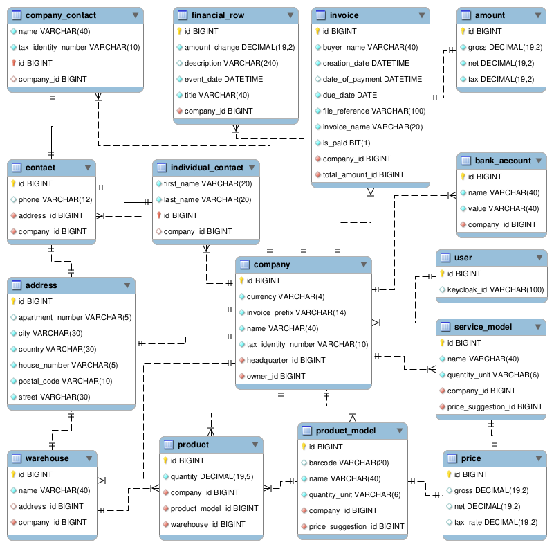

<!-- PROJECT LOGO -->
 

  

[![License][license-shield]][license-url]
![Top language][top-language-shield]
![Contributors][contributors-shield]
![Last commit][last-commit-shield]
[![LinkedIn][linkedin-shield]][linkedin-url]

<h3 align="center">Business Manager</h3>

  Generate invoices and manage your company with multiple features. 
   
  Spring Server, Keycloak & SQL DB configuration. 
   
   
  <a href="https://github.com/InBinaryWorld/BM-MobileApp/blob/master/diploma_paper.pdf"><strong>Explore the diploma paper »</strong></a>
   
  <a href="https://github.com/InBinaryWorld/BM-Servers"><strong>Explore the documents »</strong></a>
   
   
  <a href="https://github.com/InBinaryWorld/BM-Servers/issues">Report Bug</a>
  ·
  <a href="https://github.com/InBinaryWorld/BM-Servers/issues">Request Feature</a>

<!-- TABLE OF CONTENTS -->

## Table of Contents

* [About the Project](#about-the-project)
* [Services Pack](#services-pack)
  * [Resource Server](#resource-server)
  * [Database Schema](#database-schema)
* [Getting Started](#getting-started)
* [License](#license)
* [Contact](#contact)

<!-- ABOUT THE PROJECT -->

## About The Project

<a href="https://github.com/InBinaryWorld/BM-MobileApp"><strong>Check Client App Docs »</strong></a>

## Services Pack

Backend services packed with [Docker Compose](https://docs.docker.com/compose/):

* Resource Server
* MySQL DB
* Keycloak

### Resource Server

Build with:
* [iText](https://itextpdf.com)
* [Lombok](https://projectlombok.org)
* [Spring Boot](https://spring.io/projects/spring-boot)
* [Spring Security](https://spring.io/projects/spring-security)
* [Model Mapper](http://modelmapper.org)

### Database Schema

  

<!-- GETTING STARTED -->

## Getting started

[Please check chapter #7 of my thesis >>](https://github.com/InBinaryWorld/BM-MobileApp/blob/master/diploma_paper.pdf)

<!-- LICENSE -->

## License

Distributed under the [GNUv3 License][license-url]. See `LICENSE`  for more information.

<!-- CONTACT -->

## Contact

Find me on:

[![LinkedIn][linkedin-shield]][linkedin-url]
[![Github][github-user-shield]][github-user-url]

<!-- MARKDOWN LINKS & IMAGES -->

[license-shield]: https://img.shields.io/github/license/InBinaryWorld/BM-Servers

[license-url]: https://github.com/InBinaryWorld/BM-Servers/blob/master/LICENSE

[top-language-shield]: https://img.shields.io/github/languages/top/InBinaryWorld/BM-Servers

[contributors-shield]: https://img.shields.io/github/contributors/InBinaryWorld/BM-Servers

[contributors-url]: https://github.com/InBinaryWorld/BM-Servers/graphs/contributors

[last-commit-shield]:https://img.shields.io/github/last-commit/InBinaryWorld/BM-Servers

[linkedin-shield]: https://img.shields.io/badge/-LinkedIn-black.svg?style=flat-square&logo=linkedin&color=175a7a

[linkedin-url]: https://linkedin.com/in/Krzysztof-Szafraniak

[github-user-shield]: https://img.shields.io/badge/-GitHub-black.svg?style=flat-square&logo=github&color=171515

[github-user-url]: https://github.com/InBinaryWorld
